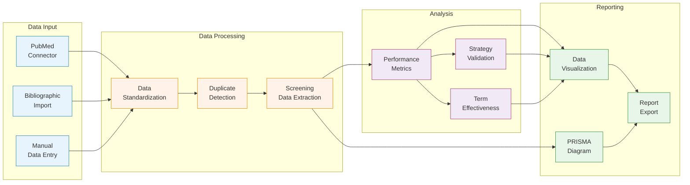
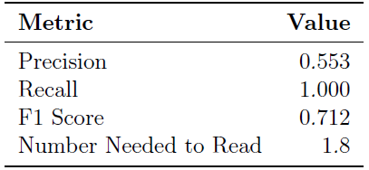
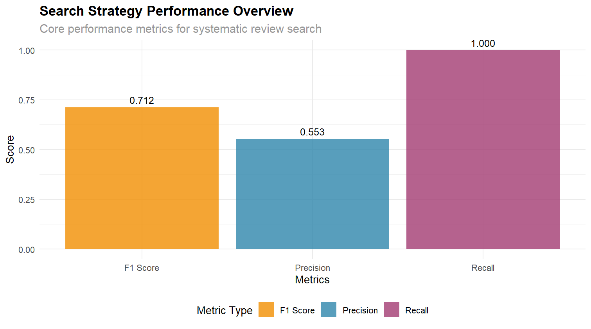
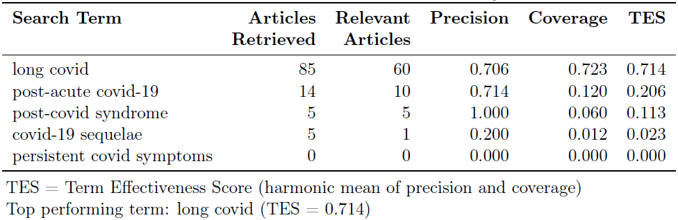
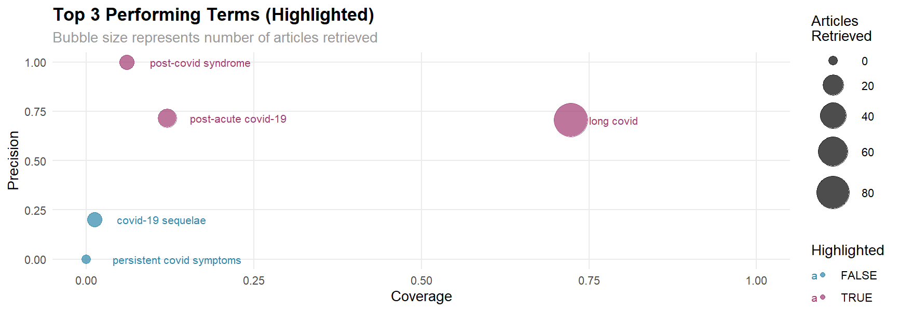

# Summary

The quality of systematic reviews fundamentally depends on the effectiveness of their search strategies, which must balance sensitivity (finding all relevant studies) with precision (minimizing irrelevant results). Developing optimal search strategies remains challenging, often relying on subjective methods rather than quantitative assessment. Despite the growing number of systematic reviews published annually—exceeding 80 per day by recent estimates [@hoffmann2021nearly]—few tools exist for quantitatively evaluating search performance. `searchAnalyzeR` is an R package that provides a comprehensive framework for developing, analyzing, and optimizing systematic review search strategies. The package connects with major bibliographic databases, standardizes heterogeneous outputs, and incorporates advanced duplicate detection algorithms. Beyond traditional precision-recall measures, `searchAnalyzeR` introduces the Term Effectiveness Score to evaluate individual search terms and workload-based metrics that quantify screening effort. Automated PRISMA-compliant reporting, visualization tools, and validation frameworks further enhance transparency and reproducibility in evidence synthesis across disciplines.

# Statement of need

Systematic reviews represent a cornerstone of evidence-based research and decision-making across disciplines, from healthcare to environmental science and public policy [@higgins2019cochrane]. However, the methods used to develop, evaluate, and optimize search strategies often lack standardization and quantitative rigor. Existing tools provide only partial support for search strategy development, with significant gaps in performance assessment and optimization [@marshall2014systematic].

Commercial platforms such as Covidence and DistillerSR focus on screening and data extraction workflows but offer limited analytics for search evaluation. Reference management tools like EndNote and Zotero support citation organization and basic duplicate detection but lack search strategy assessment functionality. While specialized tools exist for specific aspects of systematic reviews, they typically operate in isolation, creating fragmented workflows that impede efficiency and reproducibility.

`searchAnalyzeR` addresses these limitations by providing:

1. Quantitative metrics for search strategy evaluation, including novel measures like Term Effectiveness Score (TES) for assessing individual search terms' performance
2. Direct database connectivity and standardized data processing to reduce manual export/import operations
3. Advanced multi-algorithm duplicate detection that outperforms single-method approaches
4. Systematic validation frameworks for cross-domain assessment and sensitivity analysis
5. Automated PRISMA-compliant reporting and visualization for transparent documentation

This unified approach streamlines the search optimization process, potentially reducing the substantial time and resources required for systematic reviews while improving methodological rigor and reproducibility. The package is particularly valuable for information specialists, systematic review methodologists, research teams conducting evidence syntheses, and academic institutions involved in evidence-based practice.

# Key Features

The `searchAnalyzeR` package integrates multiple components to support comprehensive search strategy analysis, as shown in Figure 1.



**Figure 1.** Workflow diagram showing the main components and functionality of the searchAnalyzeR package. Color coding indicates different functional areas: data input (blue), data processing (orange), analysis (purple), and reporting (green).

## Novel Term Effectiveness Score

A key innovation of the package is the Term Effectiveness Score (TES), which evaluates individual search term performance by combining precision and coverage measures:

$$TES = \frac{2 \times Precision \times Coverage}{Precision + Coverage}$$

Unlike traditional F1 scoring, TES emphasizes term-specific coverage rather than overall strategy recall, helping researchers identify which terms contribute most effectively to their search strategy. This granular analysis enables targeted optimization that traditional aggregate metrics cannot provide.

## Multi-method Duplicate Detection

The package implements three complementary deduplication approaches to address the challenge of heterogeneous database outputs:

1. **Exact matching**: Using composite keys from normalized titles and abstracts
2. **DOI-based matching**: Standardized DOI comparison after normalization
3. **Fuzzy matching**: Jaro-Winkler string distance with configurable thresholds

This multi-method approach significantly improves deduplication accuracy compared to single-method techniques commonly used in reference management software.

## Cross-domain Validation Framework

The `BenchmarkValidator` class enables systematic testing against established benchmark datasets:

```r
validator <- BenchmarkValidator$new()
validator$add_benchmark("medical_topic", benchmark_corpus, relevant_ids)
results <- validator$cross_domain_validation(search_strategy)
```

This framework supports cross-domain validation to assess how strategies perform across different research areas—a capability absent from existing tools. The validation methodology includes systematic partitioning, stratified sampling, and comprehensive performance assessment.

## Reproducibility Tools

To ensure computational reproducibility, the package implements data packaging functionality that bundles search parameters, results, and analytical decisions into a structured format suitable for transparent reporting and independent verification.

# Example: COVID-19 Long-term Effects Search Strategy Analysis

To demonstrate the practical utility of `searchAnalyzeR`, we present a complete workflow analyzing a search strategy for COVID-19 long-term effects research:

```r
# Define comprehensive search strategy
search_strategy <- list(
  terms = c(
    "long covid",
    "post-covid syndrome",
    "covid-19 sequelae",
    "post-acute covid-19",
    "persistent covid symptoms"
  ),
  databases = c("PubMed"),
  date_range = as.Date(c("2020-01-01", "2024-12-31"))
)

# Execute search and process results
raw_results <- search_pubmed(
  search_terms = search_strategy$terms, 
  max_results = 150
)
standardized_results <- std_search_results(
  raw_results, 
  source_format = "pubmed"
)
dedup_results <- detect_dupes(
  standardized_results, 
  method = "exact"
)

# Create a demonstration gold standard
gold_standard_ids <- dedup_results %>%
  filter(!duplicate) %>%
  filter(grepl("long covid|post-covid|post-acute covid", 
               tolower(title))) %>%
  pull(id)

# Initialize analyzer and calculate metrics
analyzer <- SearchAnalyzer$new(
  search_results = filter(dedup_results, !duplicate),
  gold_standard = gold_standard_ids,
  search_strategy = search_strategy
)
metrics <- analyzer$calculate_metrics()

# Analyze term effectiveness
term_analysis <- term_effectiveness(
  terms = search_strategy$terms,
  search_results = filter(dedup_results, !duplicate),
  gold_standard = gold_standard_ids
)
term_scores <- calc_tes(term_analysis)
```

The search strategy performance metrics are summarized in Table 1, showing excellent recall but moderate precision, indicating the strategy successfully retrieved all relevant articles while also capturing a substantial number of irrelevant ones.

**Table 1.** Search Strategy Performance Metrics



```r
# Generate a bar graph for an overview of the search performance
overview_plot <- analyzer$visualize_performance("overview")
```


The term effectiveness analysis (Table 2) revealed significant variation in individual search term performance, with "long covid" demonstrating the best balance between precision and coverage. Figure 1 present an overview of the performance of the search.

**Table 2.** Individual Term Effectiveness Analysis



*TES = Term Effectiveness Score (harmonic mean of precision and coverage)*  
*Top performing term: long covid (TES = 0.714)*

 Figure 3 provides a visualization of the term effectiveness analysis that illustrates the relationship between precision, coverage, and the number of articles retrieved for each search term. The bubble plot highlights "long covid" as the most effective term, with both high precision and broad coverage, while terms like "persistent covid symptoms" retrieved no articles.



This analysis demonstrates how `searchAnalyzeR` enables quantitative assessment of search strategy performance, term-level analysis for optimization, and automated generation of publication-ready visualizations—all within a unified framework. 

# References
